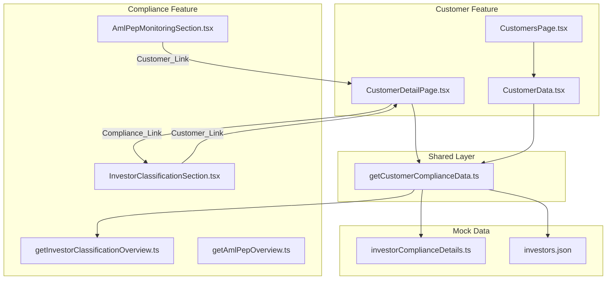

# Design Document: Customer–Compliance Interactivity

## Overview

This feature bridges the currently siloed Customer (Kundeoversikt) and Compliance (Rapporter) features by introducing bidirectional navigation and contextual data surfacing. The two features already share the same underlying data (`investors.json`, `investorComplianceDetails`) keyed by `customerId`, but offer no cross-linking today.

The design introduces:
1. A **shared compliance data lookup utility** that centralizes per-customer compliance derivation logic.
2. A **Compliance Summary card** on the Customer Detail Page showing live compliance data.
3. **Customer Links** in the Investor Registry and AML/PEP sections that navigate to the Customer Detail Page.
4. A **Compliance Status Indicator column** in the Customers Page table.
5. A **Compliance Link** from the Customer Detail Page to the Compliance Investors subpage.

All navigation uses the existing hash-based routing (`window.location.hash`). No new routing infrastructure is needed.

## Architecture



### Design Decisions

1. **Shared utility in `client/src/shared/lib/`**: The new `getCustomerComplianceData` function lives in the shared layer rather than in either feature, because both features consume it. This avoids circular dependencies and keeps the compliance derivation logic in one place.

2. **Reuse existing classification logic**: The shared utility reuses the same classification algorithm from `getInvestorClassificationOverview.ts` (status derivation based on category, industry group, and PEP review dates). This is extracted into a pure function that can be called for a single customer without computing the full overview.

3. **No new routing mechanism**: All cross-links use `window.location.hash` assignments, consistent with the existing navigation pattern in `CustomersPage`, `CustomerDetailPage`, and `CompliancePage`.

4. **No API layer changes**: The app is mock-data driven. The shared utility reads directly from the existing mock data sources (`investorComplianceDetails`, `investors.json`).

## Components and Interfaces

### New: `getCustomerComplianceData` (shared utility)

**Location**: `client/src/shared/lib/getCustomerComplianceData.ts`

```typescript
type CustomerComplianceData = {
  customerId: string;
  pepStatus: 'Ja' | 'Nei';
  amlRiskLevel: 'Lav' | 'Medium' | 'Høy';
  classificationStatus: InvestorClassificationStatus;
  classificationLabel: string;
  documentationStatus: 'Komplett' | 'Mangler oppdatering' | 'Mangler dokumentasjon';
  nextPepReviewDate: string;       // ISO format YYYY-MM-DD
  nextPepReviewLabel: string;      // Formatted DD.MM.YYYY
};

function getCustomerComplianceData(customerId: string): CustomerComplianceData | null;
```

Returns `null` when no compliance record exists for the given `customerId`. The function:
- Looks up the customer in `investorComplianceDetails` by `customerId`.
- Looks up the customer in `investors.json` to get `category`.
- Derives `classificationStatus` using the same logic as `getInvestorClassificationOverview.ts` (`getClassificationStatus`).
- Maps `classificationStatus` to a Norwegian label string via the existing `statusLabelByType` mapping.
- Formats the next PEP review date using `formatDateLabel`.

### Modified: `CustomerDetailPage.tsx`

Adds a **Compliance Summary card** in the left column below the existing customer info card. The card:
- Calls `getCustomerComplianceData(customerId)`.
- Displays PEP status, AML risk level, classification status (as a color-coded badge), documentation status, and next PEP review date.
- Includes a "Se compliance-detaljer" link that navigates to `#rapporter/investorer`.
- When `getCustomerComplianceData` returns `null`, displays "Ingen compliancedata tilgjengelig" and hides the link.

### Modified: `CustomerData.tsx`

Adds a **Compliance Status Indicator column** to the customer table:
- New column header: "Compliance".
- Each row calls `getCustomerComplianceData(customerId)` and renders a color-coded badge with the classification label.
- Clicking a non-OK badge navigates to `#rapporter/investorer`.
- When no data exists, displays "Ukjent" with neutral styling.

### Modified: `InvestorClassificationSection.tsx`

Makes investor names clickable:
- Wraps each investor name in the table with a `<button>` or `<a>` styled as a link.
- On click, navigates to `#kundeoversikt/{customerId}`.
- Uses an underline or color to distinguish from plain text.

### Modified: `AmlPepMonitoringSection.tsx`

Adds Customer Links in two places:
1. **Follow-up cards**: Adds a "Vis kundeprofil" button/link that navigates to `#kundeoversikt/{customerId}`.
2. **Full table**: Makes investor names clickable, navigating to `#kundeoversikt/{customerId}`.

## Data Models

### Existing Data (unchanged)

**`InvestorComplianceDetail`** (from `investorComplianceDetails.ts`):
```typescript
{
  customerId: string;
  industryGroup: IndustryClassificationOption | null;
  pepStatus: boolean;
  pepLastReviewDate: string;
  pepNextReviewDate: string;
  amlRiskLevel: 'Lav' | 'Medium' | 'Høy';
  documentationStatus: 'Komplett' | 'Mangler oppdatering' | 'Mangler dokumentasjon';
}
```

**Investor record** (from `investors.json`):
```typescript
{
  customerId: string;
  name: string;
  customerType: string;
  category: 'Professional' | 'Retail';
  // ... other fields
}
```

### New Type

**`CustomerComplianceData`** (returned by the shared utility):
```typescript
{
  customerId: string;
  pepStatus: 'Ja' | 'Nei';
  amlRiskLevel: 'Lav' | 'Medium' | 'Høy';
  classificationStatus: InvestorClassificationStatus;
  classificationLabel: string;
  documentationStatus: 'Komplett' | 'Mangler oppdatering' | 'Mangler dokumentasjon';
  nextPepReviewDate: string;
  nextPepReviewLabel: string;
}
```

This type reuses `InvestorClassificationStatus` from `compliance.ts`. The type definition will be placed in `client/src/shared/types/compliance.ts` (a new file) to avoid the customer feature importing from the compliance feature's internal types. The `InvestorClassificationStatus` type will be re-exported from the shared location.


## Correctness Properties

*A property is a characteristic or behavior that should hold true across all valid executions of a system — essentially, a formal statement about what the system should do. Properties serve as the bridge between human-readable specifications and machine-verifiable correctness guarantees.*

The core testable logic in this feature is the shared `getCustomerComplianceData` utility. It is a pure function (reads from static mock data, no side effects) with clear input/output behavior that varies meaningfully with input. Property-based testing is well-suited here.

### Property 1: Data field preservation

*For any* customer that has a matching record in `investorComplianceDetails`, calling `getCustomerComplianceData(customerId)` SHALL return a non-null result where:
- `pepStatus` equals `'Ja'` when the source `pepStatus` is `true`, and `'Nei'` when `false`
- `amlRiskLevel` equals the source record's `amlRiskLevel`
- `documentationStatus` equals the source record's `documentationStatus`

**Validates: Requirements 1.1, 1.2, 1.4**

### Property 2: Classification consistency with existing logic

*For any* customer that has both an investor record and a compliance detail record, the `classificationStatus` returned by `getCustomerComplianceData` SHALL equal the status that would be produced by the classification logic in `getInvestorClassificationOverview.ts` for the same customer.

**Validates: Requirements 1.3, 6.2**

### Property 3: Classification label mapping

*For any* `InvestorClassificationStatus` value, the `classificationLabel` returned by `getCustomerComplianceData` SHALL equal the corresponding Norwegian label: `'ok'` → `'Klar'`, `'mangler-naering'` → `'Mangler næringsgruppe'`, `'pep-forfaller-snart'` → `'PEP forfaller snart'`, `'pep-forfalt'` → `'PEP forfalt'`, `'ikke-profesjonell'` → `'Ikke-profesjonell'`.

**Validates: Requirements 5.2**

### Property 4: Date formatting round-trip

*For any* valid ISO date string (YYYY-MM-DD) stored as `pepNextReviewDate` in the compliance data, the `nextPepReviewLabel` returned by `getCustomerComplianceData` SHALL match the pattern `DD.MM.YYYY` where DD, MM, and YYYY correspond to the day, month, and year of the input date.

**Validates: Requirements 1.5**

### Property 5: Missing data returns null

*For any* `customerId` that does not exist in `investorComplianceDetails`, calling `getCustomerComplianceData(customerId)` SHALL return `null`.

**Validates: Requirements 1.6**

## Error Handling

This feature operates entirely on static mock data with no network calls, so error scenarios are limited:

| Scenario | Handling |
|---|---|
| `customerId` not found in `investorComplianceDetails` | `getCustomerComplianceData` returns `null`. UI shows "Ingen compliancedata tilgjengelig" and hides the compliance link. |
| `customerId` not found in `investors.json` | `getCustomerComplianceData` returns `null`. Same fallback as above. |
| `industryGroup` is `null` in compliance data | Classification logic handles this — status becomes `'mangler-naering'`. |
| Customer has no trades (empty activity) | Unrelated to compliance data. Customer detail page already handles this. |

No new error boundaries or try/catch blocks are needed. The shared utility is a pure synchronous function that always returns either a valid `CustomerComplianceData` object or `null`.

## Testing Strategy

### Property-Based Tests

The shared utility `getCustomerComplianceData` is the primary target for property-based testing. It is a pure function with a well-defined input space (customerId strings) and deterministic output.

**Library**: [fast-check](https://github.com/dubzzz/fast-check) (standard PBT library for TypeScript/JavaScript projects)

**Configuration**: Minimum 100 iterations per property test.

**Tag format**: `Feature: customer-compliance-interactivity, Property {number}: {property_text}`

Each of the 5 correctness properties above will be implemented as a single property-based test:

1. **Property 1** — Generate random selections from the mock data, verify field preservation.
2. **Property 2** — Generate random customer IDs from the mock data, compare shared utility output with existing classification function output.
3. **Property 3** — Generate random `InvestorClassificationStatus` values, verify label mapping.
4. **Property 4** — Generate random valid ISO dates, verify formatting.
5. **Property 5** — Generate random strings not in the mock data's customer IDs, verify null return.

### Unit Tests (Example-Based)

Unit tests cover UI rendering and navigation behavior that is not suitable for PBT:

- **CustomerDetailPage**: Renders compliance summary card with correct data; hides card and link when no data; "Se compliance-detaljer" link navigates to `#rapporter/investorer`.
- **CustomerData**: Renders compliance column; shows correct badge colors; "Ukjent" for missing data; clicking non-OK badge navigates.
- **InvestorClassificationSection**: Investor names are clickable links; clicking navigates to `#kundeoversikt/{customerId}`; links are visually distinguishable.
- **AmlPepMonitoringSection**: "Vis kundeprofil" button present on cards; clicking navigates correctly; investor names in table are clickable.

### Test File Locations

- `client/src/shared/lib/__tests__/getCustomerComplianceData.test.ts` — Property-based tests + unit tests for the shared utility.
- Component-level tests alongside their respective components (if a test framework is set up for component testing).
